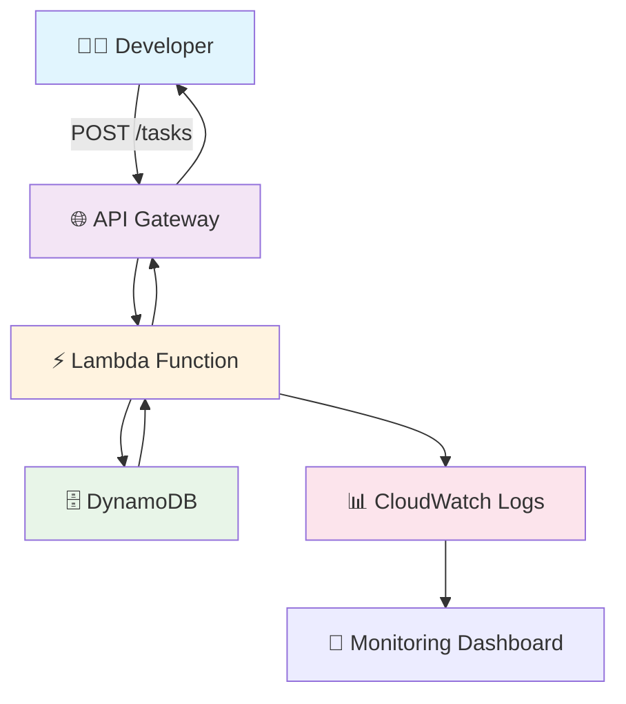
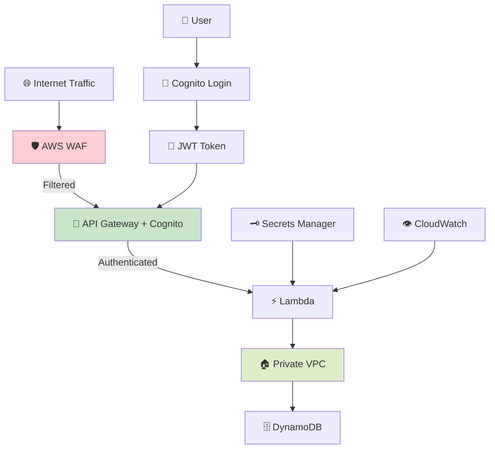

# 🏗️ Diagramas de Evolución Arquitectural de TaskFlow

> **Recursos visuales para la presentación**  
> *Diagramas ASCII + Mermaid para mostrar la evolución de TaskFlow*

## 📊 Diagramas por Acto

### **🚲 ACTO I: MVP Architecture (Slide 8)**

```
┌─────────────────────────────────────────────────────────────┐
│                    TASKFLOW MVP v1.0                        │
│                 "Elegancia en la Simplicidad"               │
└─────────────────────────────────────────────────────────────┘

┌─────────────────────┐    ┌─────────────────────┐    ┌──────────────────┐
│                     │    │                     │    │                  │
│   📱 CLIENT APP      │    │   🌐 API GATEWAY    │    │  ⚡ LAMBDA        │
│                     │    │                     │    │                  │
│ • Web Frontend      │───▶│ • Auto HTTPS        │───▶│ • Java 21        │
│ • Mobile App        │    │ • CORS enabled      │    │ • Business Logic │
│ • Postman          │    │ • Rate limiting     │    │ • Stateless      │
│                     │    │                     │    │                  │
└─────────────────────┘    └─────────────────────┘    └──────────────────┘
                                                                    │
                                                                    ▼
┌─────────────────────────────────────────────────────────────────────────┐
│                            🗄️ DYNAMODB                                  │
│                                                                         │
│  • NoSQL database                    • Pay-per-request billing          │
│  • Auto-scaling                      • Point-in-time recovery           │
│  • Multi-AZ replication              • Backup included                  │
└─────────────────────────────────────────────────────────────────────────┘
                                    │
                                    ▼
┌─────────────────────────────────────────────────────────────────────────┐
│                          👀 CLOUDWATCH                                  │
│                                                                         │
│  • Real-time logs                    • Custom metrics                   │
│  • Performance monitoring            • Automated alerts                 │
│  • Error tracking                    • Free tier included               │
└─────────────────────────────────────────────────────────────────────────┘

💰 MONTHLY COST: $0-5 (AWS Free Tier)
⚡ CAPACITY: 1,000 req/sec out-of-the-box  
🛡️ SECURITY: HTTPS by default
```

### **🔒 ACTO II: Enterprise Security (Slide 15)**

```
┌─────────────────────────────────────────────────────────────┐
│                   TASKFLOW v2.0                             │
│              "Houston, Tenemos Usuarios"                    │
└─────────────────────────────────────────────────────────────┘

                              🛡️ AWS WAF
                         ┌─────────────────────┐
                         │                     │
                         │ • SQL Injection ❌  │
┌─────────────────┐     │ • XSS Protection    │     ┌─────────────────┐
│                 │     │ • Rate Limiting     │     │                 │
│   📱 CLIENTS    │────▶│ • Geo-blocking      │────▶│  🌐 API GATEWAY │
│                 │     │ • IP Whitelist      │     │                 │
│ • Web Apps      │     │                     │     │ • JWT Validation│
│ • Mobile Apps   │     └─────────────────────┘     │ • CORS          │
│ • 3rd Party     │              │                  │ • Throttling    │
└─────────────────┘              │                  └─────────────────┘
        │                        │                           │
        │                        ▼                           ▼
        │           ┌─────────────────────┐      ┌─────────────────────┐
        │           │                     │      │                     │
        └──────────▶│  🔐 COGNITO         │      │   ⚡ LAMBDA          │
                   │                     │      │                     │
                   │ • User Pools        │      │ • Authorized Access │
                   │ • JWT Tokens        │      │ • Business Logic    │
                   │ • MFA Support       │      │ • Error Handling    │
                   │ • Social Login      │      │                     │
                   └─────────────────────┘      └─────────────────────┘
                                                           │
                              ┌────────────────────────────┘
                              │
                              ▼
                   ┌─────────────────────┐      ┌─────────────────────┐
                   │                     │      │                     │
                   │  🏠 VPC PRIVATE     │      │   🗝️ SECRETS        │
                   │                     │      │                     │
                   │ • Isolated Network  │      │ • API Keys Rotation │
                   │ • Private Subnets   │      │ • Encrypted Storage │
                   │ • NAT Gateway       │      │ • Access Control    │
                   │                     │      │                     │
                   └─────────────────────┘      └─────────────────────┘
                              │
                              ▼
                   ┌─────────────────────────────────────────────────┐
                   │             🗄️ DYNAMODB                         │
                   │                                                 │
                   │ • Encryption at rest     • VPC Endpoints       │
                   │ • Fine-grained access    • Audit logging       │
                   └─────────────────────────────────────────────────┘

🔒 SECURITY: 99.8% ataques bloqueados
⚡ PERFORMANCE: <100ms latencia global
💰 ARR: $50K → $500K en 8 meses
```

### **🏢 ACTO III: Enterprise Scale (Slide 21)**

```
┌─────────────────────────────────────────────────────────────┐
│                     TASKFLOW v3.0                           │
│                 "Enterprise Ready"                          │
└─────────────────────────────────────────────────────────────┘

                    ┌─────────────────────────────────────────┐
                    │        🌍 MULTI-REGION                  │
                    │                                         │
                    │  US-EAST-1  │  EU-WEST-1  │  AP-SOUTH-1 │
                    │     🏢       │     🏢      │      🏢     │
                    └─────────────────────────────────────────┘
                                        │
┌─────────────────┐                     │                ┌─────────────────┐
│                 │                     ▼                │                 │
│  🔄 CI/CD       │       ┌─────────────────────┐       │  👁️ OBSERVABILITY│
│                 │       │                     │       │                 │
│ • GitHub Actions│◄─────▶│   🛡️ SECURITY       │──────▶│ • X-Ray Tracing │
│ • Auto Deploy  │       │                     │       │ • Custom Metrics│
│ • Blue/Green    │       │ • GuardDuty         │       │ • Real-time     │
│ • Rollback      │       │ • Security Hub      │       │ • Alerting      │
│                 │       │ • Config Rules      │       │                 │
└─────────────────┘       │ • CloudTrail        │       └─────────────────┘
                         └─────────────────────┘
                                    │
        ┌───────────────────────────┼───────────────────────────┐
        │                           │                           │
        ▼                           ▼                           ▼
┌─────────────────┐    ┌─────────────────────┐    ┌─────────────────┐
│                 │    │                     │    │                 │
│ 🏗️ IaC          │    │   ⚡ SERVERLESS     │    │ 📊 DATA         │
│                 │    │                     │    │                 │
│ • Terraform     │    │ • Auto-scaling      │    │ • Analytics     │
│ • CloudFormation│    │ • Event-driven      │    │ • ML Pipeline   │
│ • GitOps        │    │ • Cost optimized    │    │ • Data Lake     │
│ • Multi-env     │    │ • 99.99% uptime     │    │ • Reports       │
│                 │    │                     │    │                 │
└─────────────────┘    └─────────────────────┘    └─────────────────┘

📊 DEVOPS METRICS (Elite Performer):
• Deploy frequency: 50+ per day
• Lead time: 15 min (commit → production)  
• MTTR: <5 minutes
• Change failure rate: <2%

💰 BUSINESS IMPACT:
• 10M+ monthly active users
• $100M ARR
• 99.99% uptime SLA
• $1.2B valuation
```

---

## 🎨 Diagramas Mermaid (Para presentación digital)

### **MVP Flow Diagram:**


### **Security Evolution:**


### **Enterprise Pipeline:**

```mermaid
graph LR
    A[💻 Git Commit] --> B[🔍 Security Scan]
    B --> C[🧪 Unit Tests]
    C --> D[🏗️ Build]
    D --> E[🚀 Deploy Dev]
    E --> F[✅ Integration Tests]
    F --> G[🎭 Deploy Staging]
    G --> H[🔍 E2E Tests]
    H --> I[✅ Manual Approval]
    I --> J[🏭 Deploy Production]
    J --> K[📊 Monitor]
    
    style A fill:#e3f2fd
    style B fill:#ffecb3
    style J fill:#c8e6c9
    style K fill:#f8bbd9
```


---

## 📐 Diagramas de Costos por Escala

### **Cost Evolution Chart:**
```
💰 COSTO MENSUAL vs SCALE

$10,000 ┤                                             ╭─ Traditional
        │                                         ╭─╯
 $1,000 ┤                                     ╭─╯
        │                                 ╭─╯
   $100 ┤                             ╭─╯
        │                         ╭─╯
    $10 ┤                     ╭─╯                     
        │ ╭─╯╱╱╱╱╱╱╱╱╱╱╱╭─╯ ◄─ Serverless
     $1 ┤╯                                           
        │
     $0 └┬───┬───┬───┬───┬───┬───┬───┬───┬───┬───┬─
         0   1K  10K 100K  1M  10M 100M  1B   
                    REQUESTS PER MONTH

🎯 Break-even: ~100K requests/month
📊 Serverless sweet spot: Variable traffic patterns
💡 Traditional: Better for constant high traffic
```

---

## 🎯 Guía de Uso de Diagramas

### **Para Slide 8 (MVP):**
- Mostrar la simplicidad de 4 componentes principales
- Enfatizar conexiones automáticas
- Destacar costo $0-5

### **Para Slide 15 (Security):**  
- Comparación lado a lado: v1 vs v2
- Destacar nuevas capas de seguridad
- Mostrar flujo de autenticación

### **Para Slide 21 (Enterprise):**
- Complejidad controlada
- Pipeline CI/CD visual
- Métricas de performance

### **Para Slide 23 (Business Impact):**
- Gráfico de costos vs escala
- Timeline de crecimiento
- ROI visualization

---

## 🛠️ Herramientas para Crear Diagramas

### **ASCII Art Tools:**
- **asciiflow.com** - Web-based ASCII diagram editor
- **textik.com** - Simple ASCII diagram creator
- **draw.io/ascii** - Convert diagrams to ASCII

### **Mermaid Tools:**
- **mermaid-js.github.io/mermaid-live-editor** - Live editor
- **VS Code Mermaid Preview** - Extension para preview
- **GitHub** - Native Mermaid support

### **Architecture Tools:**
- **Lucidchart** - Professional diagramming
- **AWS Architecture Icons** - Official AWS icon set
- **draw.io** - Free online diagramming tool

---

## 💡 Tips para Presentación

### **Revelación Progresiva:**
1. **Slide 8:** Mostrar solo los 4 componentes básicos
2. **Slide 15:** Revelar capas de seguridad una por una
3. **Slide 21:** Construir pipeline paso a paso

### **Storytelling Visual:**
- Usar colores consistentes (azul=infraestructura, verde=seguridad, naranja=observabilidad)
- Íconos reconocibles (📱🌐⚡🗄️)
- Flujos de izquierda a derecha

### **Interactividad:**
- "¿Ven cómo cada componente se conecta automáticamente?"
- "Aquí es donde agregamos la siguiente capa..."
- "¿Notan la diferencia en complejidad?"

---

*🎨 Estos diagramas están diseñados para funcionar tanto en presentaciones digitales como impresas*  
*📊 Usa los ASCII para handouts, Mermaid para slides digitales*